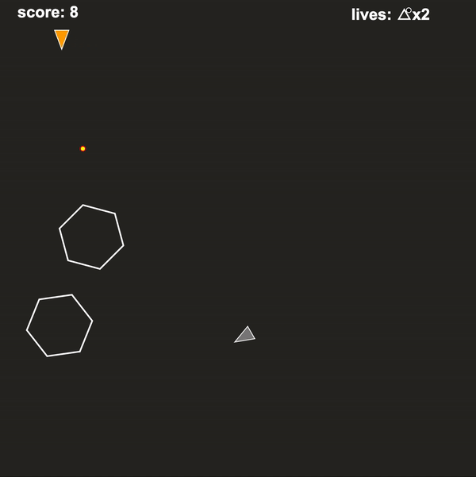

# Asteroids
Try out the game on Google Chrome here: https://alxojy.github.io/FIT2102-asteroids/ (It currently only works on desktop)

## FIT2102 Assignment 1 2019
The purpose of this assignment was to create an asteroids game while implementing the observer pattern. The code written abides by functional programming rules and is Typesafe. 

The Observable stream is used to observe keyboard events with causes the player's ship to move and shoot bullets. Furthermore, it is also used to update the state of the asteroids, bullets and enemy ship.

The challenge was to ensure that all functions are pure which means that there are no side effects. The code that I have written however, is not completely pure as there are mutable variables required for elements in the game to move such as the x, y, speed and angle attributes. Furthermore, lists are used to store references of the asteroids and bullets in the game. This is required to detect collisions between bullets and asteroids. I minimised the usage of mutable variables whereby it is only present in the code because it is required to model more complex features in the cleanest way possible.

Side-effects in the code have been minimised and contained in the Observable ```subscribe``` function. Lastly, the parameter and function return types have been specified to ensure that the code is Typesafe.

## Features implemented
- Big asteroids break down into smaller asteroids when shot. 
- Only small asteroids can be destroyed by the player's spaceship. 
- Multiple lives have been implemented. 
- A life is deducted and the game resets when the player's spaceship crashes into an asteroid, collides with the enemy spaceship's bullet or the enemy's spaceship. 
- The game displays game over when there are no lives left and automatically refreshes the page. 
- A scoring system has been implemented. (Big asteroid = 1 point, small asteroid = 2 points). 
- Particles exploding effect when an asteroid has been shot. 
- An enemy spaceship that shoots at the player's spaceship has been implemented. It moves with varying speed. 
 - Handling more than one key press. 
 
 ## Gameplay
 
 
 ## Note

This repo has been created to share my project and for future students taking this unit to get an idea on what the assignment is about. However, I do not condone the act of plagiarism so only use my work as a reference, if you wish.  

 ## Plagiarism notice
Copying or plagiarising code is a serious offence and will result in a breach in the Academic Integrity Policy https://www.monash.edu/students/academic/policies/academic-integrity. I will not be held responsible for any of these breaches.

Assignment base by Professor Tim Dwyer.

I scored a HD (96) for this assignment.
